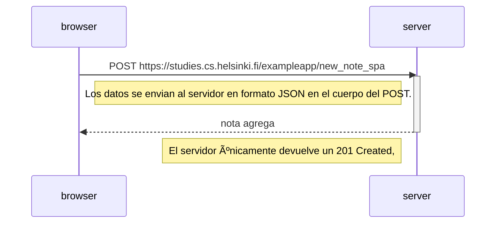

```mermaid
sequenceDiagram
    participant browser
    participant server

    browser->>server: POST https://studies.cs.helsinki.fi/exampleapp/new_note_spa
    activate server
    
    Note right of browser: Los datos se envian al servidor en formato JSON en el cuerpo del POST.

    server-->>browser: nota agrega
    deactivate server

    Note left of server: El servidor únicamente devuelve un 201 Created,

```
